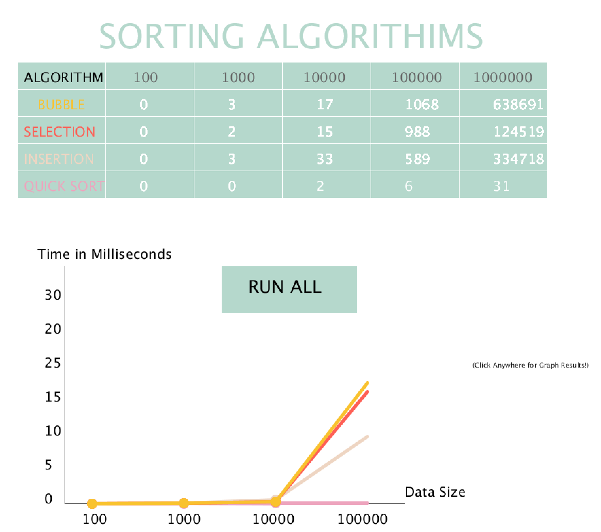

# Sorting Algorithm Visualization and Comparison 📊

Welcome to the Sorting Algorithm Visualization and Comparison program! This Processing project allows you to visualize and compare the performance of four popular sorting algorithms: Quick Sort, Selection Sort, Insertion Sort, and Bubble Sort. Gain insights into their sorting efficiency and see how they stack up against each other.

## Table of Contents

- [Features](#features)
- [Sorting Algorithms](#sorting-algorithms)
- [Performance Comparison](#performance-comparison)

## Features

🔀 **Sorting Algorithms**: Visualize the working of Quick Sort, Selection Sort, Insertion Sort, and Bubble Sort.

📈 **Performance Comparison**: Compare the execution times of these sorting algorithms for various input sizes.

🌈 **Interactive Visualization**: Enjoy an interactive and colorful visualization of the sorting process.

🧐 **Educational**: Use this tool to learn about sorting algorithms or teach others about them.

💻 **Processing Code**: The program is coded in Processing, making it easy to understand and extend.

## Sorting Algorithms

### Quick Sort

Quick Sort is a fast and efficient sorting algorithm that uses a divide-and-conquer approach. It's known for its average-case time complexity of O(n log n).

### Selection Sort

Selection Sort is a simple and intuitive sorting algorithm that repeatedly selects the smallest (or largest) element and moves it to its final position. It has a time complexity of O(n^2).

### Insertion Sort

Insertion Sort is a stable and adaptive sorting algorithm that builds the final sorted array one item at a time. Its time complexity is O(n^2).

### Bubble Sort

Bubble Sort is a simple sorting algorithm that repeatedly steps through the list, compares adjacent elements, and swaps them if they are in the wrong order. Its time complexity is O(n^2).

## Performance Comparison

The program provides a performance comparison feature, allowing you to compare the execution times of these sorting algorithms for different input sizes. You can observe how their efficiency varies as the input size increases.

Enjoy visualizing and comparing sorting algorithms with the Sorting Algorithm Visualization and Comparison program! 📊🔀🧮
